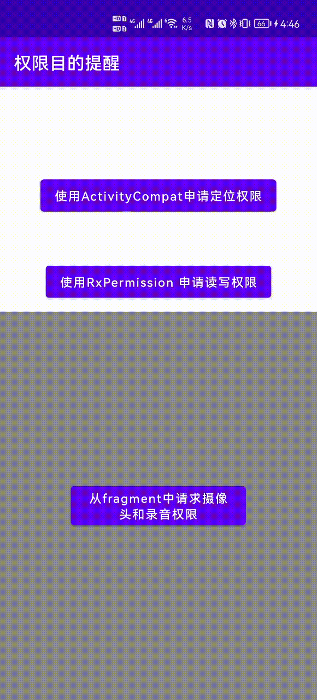
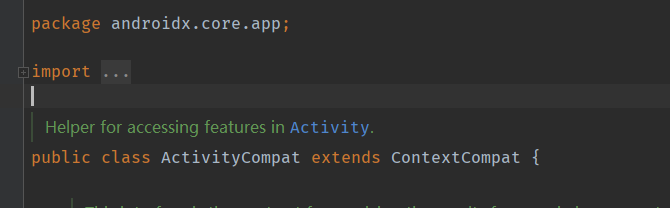

# Permission_aim_tip

# 作用

因为越来越严格的隐私政策要求，需要在申请权限的时候，告知用户需要该权限的目的。为了能快速适配已有项目，需要一个能自动感知权限申请，并显示的原因的框架。于是编写了该框架。


# 效果




# 特点

1. 100%拦截fragment的权限请求
2. 100%拦截 RxPermission的权限请求(因为RxPermission就是基于Fragment)
3. 方便配置，使用json配置
4. 集成简便，一行代码即可。
5. 可定制UI

# 使用

## 注册代理


只需要在Application中注册即可使用

```java
public class MyApp  extends Application {

    @Override
    public void onCreate() {
        super.onCreate();
        //注册代理，一句话即可使用
        PermissionAimTipDelegate.initPermissionTip(new TRSTipShowController
                (new RawAimTipAdapter(this, R.raw.permission_aim_description)));
    }
}
```


## 填写配置文件


其中的**R.raw.permission_aim_description** 是配置文件的id （保存在raw文件夹下）。配置文件如下

```json
[
  {
    "androidPermissionNames": [
      "android.permission.ACCESS_FINE_LOCATION",
      "android.permission.ACCESS_COARSE_LOCATION"
    ],
    "showPermissionName": "定位 GPS定位，WIFI定位",
    "permissionAimDescription": "用于新闻下微站展示,自动定位区县栏目展示场景"
  },
  {
    "androidPermissionNames": [
      "android.permission.WRITE_EXTERNAL_STORAGE",
      "android.permission.READ_EXTERNAL_STORAGE"
    ],
    "showPermissionName": "内存读，写",
    "permissionAimDescription": "用于APP写入/下载/保存/读取图片、文件等信息"
  },
  {
    "androidPermissionNames": [
      "android.permission.CAMERA"
    ],
    "showPermissionName": "访问摄像头",
    "permissionAimDescription": "用于拍照、录制视频、扫一扫AR识别等场景"
  },
  {
    "androidPermissionNames": [
      "android.permission.RECORD_AUDIO"
    ],
    "showPermissionName": "录音功能",
    "permissionAimDescription": "通过手机和耳机的麦克 用于录音、语音检索等场景"
  }

]
```

### 配置说明

| 字段名称                 | 用途                                                         |
| ------------------------ | ------------------------------------------------------------ |
| androidPermissionNames   | 用来配置对应的权限，如果用户申请的权限包括在其中。那么就会提示用户。必须是**Manifest.permission**中定义的常量 |
| showPermissionName       | 用于显示给用户看的权限名称                                   |
| permissionAimDescription | 权限目的的描述                                               |

## Activity中使用

需要如下使用才能拦截

```java
  ActivityCompat.requestPermissions(this, locationPermission, 100);
```

其中的ActivityCompat是Android本身的适配库



# gradle 集成

